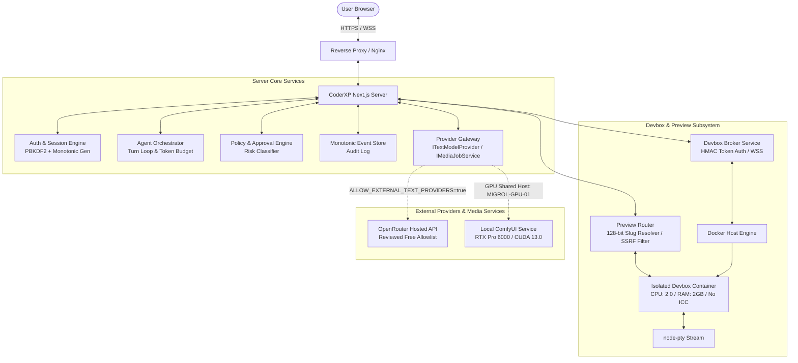
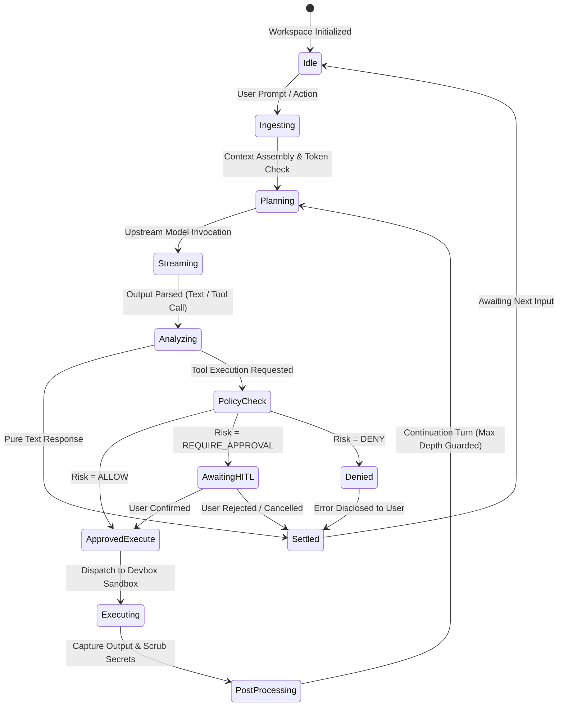

# Autonomous Workspace v1 — Architecture & Design Specification

**Document Version:** 1.0.0  
**Status:** Approved Architecture Draft  
**Target Release:** CoderXP 1.0  
**Authors:** CoderXP Core Architecture Team  
**Review Gate:** Core Review  

---

## 1. Executive Summary & Core Principles

CoderXP Autonomous Workspace v1 provides an isolated, browser-accessible execution and development environment for autonomous and semi-autonomous AI coding agents. Unlike traditional cloud IDEs or unconstrained local agents, CoderXP enforces strict separation between:

1. **Agent Intelligence Layer:** High-level turn planning, code generation, reasoning, and tool selection (driven by LLMs via decoupled providers).
2. **Environment Execution Layer:** Pinned, containerized execution sandboxes (Devboxes) with strictly bounded memory, CPU, PID limits, and isolated networking.
3. **Client Presentation & Control Layer:** Browser-based IDE offering real-time streaming, interactive PTY terminal, live application preview, and human-in-the-loop (HITL) approval gates.

### Core Architectural Invariants

* **Fail-Closed Security by Default:** Any missing credential, ambiguous policy check, network partition, or unverified model strictly halts execution rather than falling back to unvetted or paid defaults.
* **Least Privilege Execution:** Containers execute as unprivileged users (`UID 1000:GID 1000` or `coderxp-media 999:988`). Privileged host resources (Docker sockets, host systemd, kernel namespaces) are completely inaccessible to devboxes.
* **Network & SSRF Isolation:** Containers run on an isolated bridge network with Inter-Container Communication (ICC) disabled by default. Upstream cloud metadata endpoints (`169.254.169.254`), host loopback (`127.0.0.1`), and internal RFC-1918 subnets are filtered at the routing boundary.
* **Deterministic Event Sourcing:** Every agent action, approval request, terminal output fragment, and filesystem modification is captured in an append-only, monotonically sequenced event store.

---

## 2. System Architecture & Component Topology

### Component Roles

1. **Agent Orchestrator (`AgentOrchestrator`):**
   - Coordinates multi-turn execution loops.
   - Monitors conversation token consumption against provider limits.
   - Dispatches tool invocations through the `PolicyEngine`.
   - Performs proactive context window compaction when conversational history nears maximum capacity.

2. **Policy & Approval Engine (`PolicyEngine`):**
   - Evaluates requested actions against risk tiers:
     - **ALLOW (Safe):** Workspace-scoped file reads, standard non-destructive commands (`ls`, `npm test`, `git status`).
     - **REQUIRE_APPROVAL (Guarded):** Out-of-workspace writes, network port bindings, dependency additions, non-destructive file removals.
     - **DENY (Dangerous):** Recursive root deletions (`rm -rf /`), raw device writes (`dd`), fork bombs, privilege escalations (`sudo`, `su`), cloud metadata calls.
   - Manages approval state transitions: `PENDING -> APPROVED -> EXECUTED` or `PENDING -> REJECTED`.

3. **Devbox Execution Engine & Broker:**
   - Spawns isolated Docker containers per project workspace.
   - Enforces tier-based capacity limits: Free Tier (0.5 CPU, 512 MB RAM), Pro Tier (2.0 CPU, 2048 MB RAM).
   - Manages PTY terminal sessions over WebSocket using HMAC-signed, single-use authentication tokens.
   - Performs automated idle process sweeping and zombie process reaping.

4. **Live Preview Router (`PreviewRouter`):**
   - Generates cryptographically secure, 128-bit preview slugs for devbox web servers.
   - Maps incoming preview requests directly to private container IP endpoints on permitted ports (`3000-8999`).
   - Filters host loopback (`127.0.0.1`), link-local (`169.254.x.x`), and unspecified addresses (`0.0.0.0`) to neutralize SSRF vectors.

5. **Provider Gateway (`lib/server/providers/`):**
   - Decoupled contracts defining `ITextModelProvider` and `IMediaJobService`.
   - Hosted API adapters (OpenRouter) gated behind fail-closed server environment variables (`ALLOW_EXTERNAL_TEXT_PROVIDERS=false` by default).
   - Local media generation contracts designed for dedicated GPU server infrastructure (`MIGROL-GPU-01`).

---

## 3. Execution Lifecycle & Turn State Machine

Every autonomous agent interaction progresses through a deterministic lifecycle:

### Turn Lifecycle Details

1. **Context Assembly:** Aggregates project filesystem metadata, active file buffers, recent terminal logs, and system prompt. Verifies aggregate size against the model token budget.
2. **Streaming Execution:** Emits text deltas in real-time to the client UI. Interleaves heartbeat frames every 15s to keep connections healthy over long generation windows.
3. **Secret Redaction:** Outbound stdout/stderr and conversational text streams pass through a chunk-boundary-aware regex scrubber that redacts API keys (Anthropic, OpenAI, OpenRouter, Google, etc.), GitHub PATs, and generic bearer tokens before reaching the client or persistent logs.
4. **Max Turn Depth Enforcement:** Hard ceiling on recursive autonomous continuation loops (default: 20 turns) preventing runaway executions or financial loops.

---

## 4. Resource Containment & Compensating Controls

To prevent host exhaustion on shared infrastructure:

### Devbox Containment Specification

| Dimension | Default Limit (Free) | Pro Tier Limit | Enforcement Mechanism |
|---|---|---|---|
| **CPU Saturation** | 0.5 CPU | 2.0 CPUs | Docker cgroups (`--cpus`) |
| **Memory Ceiling** | 512 MB | 2048 MB | Docker memory limit + OOM killer |
| **Max Concurrent PIDs** | 64 | 256 | Docker `--pids-limit` |
| **Disk Storage** | 2 GB ephemeral | 10 GB persistent | Docker storage quota / volume driver |
| **Idle Process Reaper** | 15 minutes | 60 minutes | Host daemon sweeping inactive PTY sessions |
| **Container Retention** | 2-step deletion (24h grace) | 2-step deletion (7d grace) | Tombstone state reaper |

### Compensating Controls for Daemon Degradation

- **Daemon Loss Fail-Closed:** If the host Docker daemon becomes unresponsive, the Devbox manager rejects new spawn requests with HTTP 503 (`DEVBOX_DAEMON_UNAVAILABLE`) and retains state in SQLite until recovery.
- **OOM Kill Telemetry:** Container memory terminations trigger structured log events (`DEVBOX_OOM_KILLED`), notifying the user with actionable suggestions rather than hanging the workspace.
- **Orphan Volume Purge:** Detached or orphaned containers in `PENDING_DELETION` status are swept after the grace period expires, reclaiming host disk space automatically.

---

## 5. Security Invariants & Compliance

1. **Zero Secrets in Code or Storage:** Credentials never enter Git trees, environment dumps, or client-rendered markdown.
2. **Cryptographic Authentication:** Admin access and devbox token minting use PBKDF2 (100,000 rounds, SHA-512) and HMAC-SHA256 signatures with constant-time equality comparisons (`crypto.timingSafeEqual`).
3. **Audit Trail Completeness:** All approval transitions, tool execution results, and credential rotations append immutable audit entries to the event store with millisecond-precision timestamps.
4. **Stable External Interfaces:** The `lib/server/providers/types.ts` interface definitions (`ITextModelProvider`, `IMediaJobService`, `MediaGenerationRequest`, `JobRecord`) serve as an invariant API contract across collaborating development departments.
